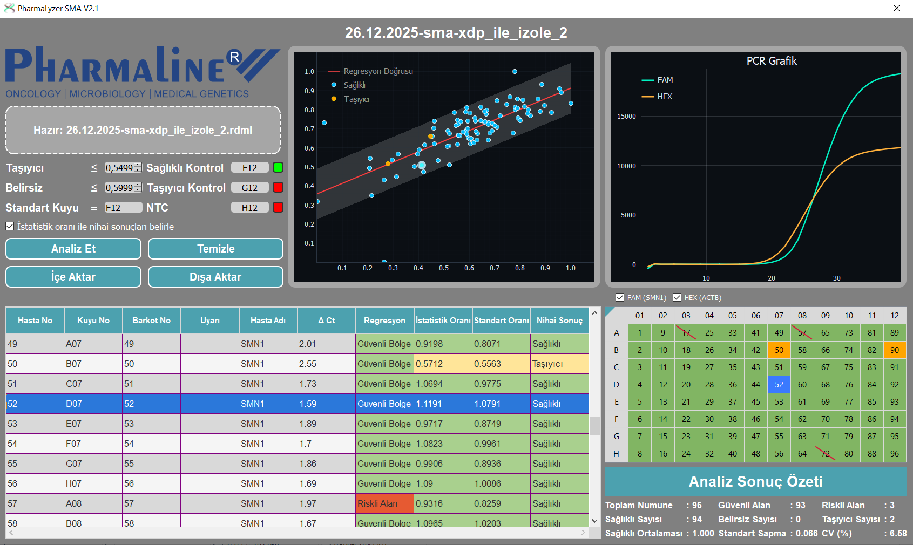
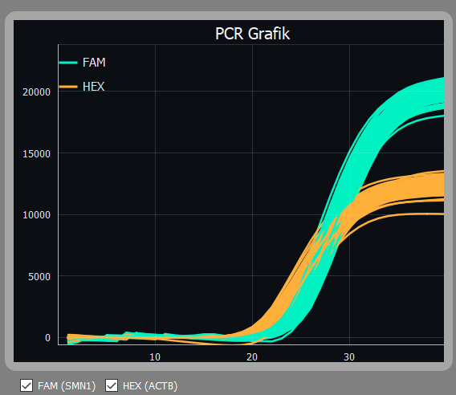
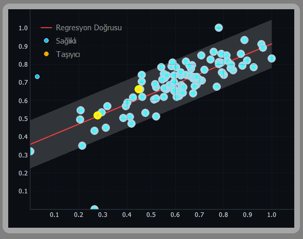
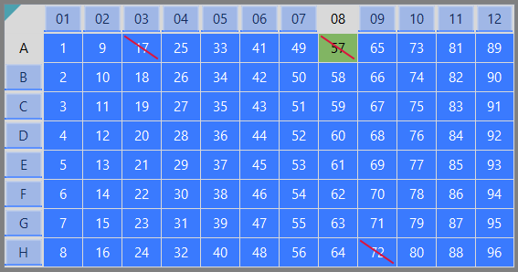
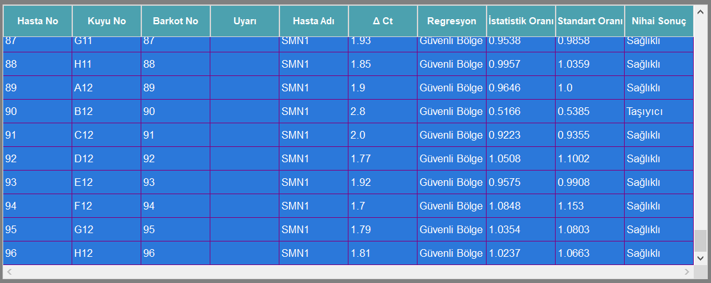

# PharmaLyser SMA

<p align="center">
  
</p>


---

## Overview

PharmaLyser SMA is a clinical-grade desktop application designed for **Spinal Muscular Atrophy (SMA) carrier screening** via real-time PCR data analysis. It processes RDML files from PCR machines and provides automated patient classification with interactive visualization tools.

> **Note:** This repository contains a partial open-source release showcasing the architecture and key modules. The full application is proprietary software developed for [PharmaLine](https://pharmaline.com).

---

## Screenshots

<p align="center">
  
  <br><em>Main application view with PCR curves, 96-well plate, and results table</em>
</p>

<p align="center">
  
  
  <br><em>Left: Interactive PCR amplification curves (60+ FPS) | Right: Regression scatter plot with safe zone</em>
</p>

<p align="center">
  
  
  <br><em>Left: Interactive 96-well plate with drag selection | Right: Color-coded results table</em>
</p>

---

## Key Features

### 🧬 Analysis Pipeline
- **5-step sequential pipeline**: Preprocessing → Reference calculation → Regression → Statistical optimization → Result formatting
- **Dual classification modes**: Reference-based (ΔΔCt) and reference-free (KMeans + L-BFGS-B optimization)
- **Dynamic k-selection** with automated validation criteria
- **Regression-based outlier detection**: Iterative regression and MAD-based robust regression

### 📊 Interactive Visualization
- **PCR Amplification Curves**: Custom PyQtGraph renderer with spatial indexing, hover detection, and drag selection at 60+ FPS
- **96-Well Plate Widget**: Interactive plate with click, drag, Shift+click range selection, and header selection
- **Regression Scatter Plot**: Safe zone visualization, hover tooltips, and Ctrl+click multi-selection
- **Bidirectional synchronization**: All widgets communicate through a centralized InteractionStore

### 🏗️ Architecture
- **MVC Pattern**: Clean separation of controllers, models, views, and services
- **Thread-Safe Design**: Background analysis with cooperative cancellation, RLock-protected DataStore
- **Render Scheduling**: Frame-rate limited rendering (~60 FPS) with batched updates
- **i18n Support**: JSON-based translation system with lazy loading and fallback

---

## Architecture

```
app/
├── bootstrap/          # Startup: splash screen, resource paths, warmup
├── config/             # Settings management (env-based configuration)
├── constants/          # Style tokens, table config, export presets
├── controllers/        # MVC controllers
│   ├── main_controller.py      # Central orchestrator
│   ├── analysis/       # Colored box validation
│   ├── app/            # Drag-drop, export
│   ├── graph/          # PCR graph visibility
│   ├── interaction/    # Widget interaction wiring
│   ├── table/          # Table controller & interaction
│   └── well/           # Well input validation
├── exceptions/         # Structured error handling with i18n
├── i18n/               # Translation system (JSON-based)
├── licensing/          # Device-bound license validation
├── logging/            # Rotating file logger setup
├── models/
│   ├── main_model.py           # State + async analysis
│   └── workers/                # QThread-based analysis worker
├── services/
│   ├── analysis_service.py     # Pipeline orchestration
│   ├── analysis_steps/         # 5 calibrated pipeline steps
│   ├── data_store.py           # Thread-safe DataFrame storage
│   ├── interaction_store.py    # Centralized UI state
│   ├── pcr_data_service.py     # Coordinate caching (LRU)
│   ├── pipeline.py             # Sequential step executor
│   ├── rdml_service.py         # RDML file processing
│   └── export/                 # Excel/TSV export
├── utils/
│   ├── well_mapping.py         # 96-well coordinate system
│   ├── rdml/                   # RDML reader & parser
│   └── validators/             # Well ID validators
└── views/
    ├── main_view.py            # PyQt5 main window
    ├── plotting/               # PyQtGraph renderers
    │   ├── pcr_graph_pg/       # PCR curve renderer (8 modules)
    │   └── regression/         # Regression plot renderer
    ├── table/                  # Editable table model & delegates
    └── widgets/                # Custom widgets (plate, graphs)
```

---

## Technical Highlights

### Analysis Pipeline

| Step | Module | Description |
|------|--------|-------------|
| 1 | `CSVProcessor` | RDML preprocessing, RFU extraction, ΔCt calculation, quality warnings |
| 2 | `CalculateWithReferance` | ΔΔCt calculation, ratio computation (2^-ΔΔCt), threshold classification |
| 3 | `CalculateRegression` | Iterative/MAD-based regression, outlier detection |
| 4 | `CalculateWithoutReference` | KMeans, L-BFGS-B optimization, gradient adjustment |
| 5 | `ConfigurateResultCSV` | Patient numbering, final result selection, column reordering |

### Performance Optimizations

- **Spatial Indexing**: AABB-based spatial index for O(log n) hover detection on PCR curves
- **Pen Caching**: Global QPen cache eliminates 90% of repeated pen creation
- **Render Scheduling**: Timer-based frame limiting prevents UI blocking during interactions
- **LRU Coordinate Cache**: 4096-item cache for PCR coordinate parsing
- **Viewport Clipping**: Automatic downsampling for datasets >20k points

### Thread Safety

- `DataStore`: RLock-protected singleton for concurrent DataFrame access
- `AnalysisWorker`: QThread worker with cooperative cancellation
- `MainController`: `_closing` flag prevents post-shutdown UI updates
- Signal-based communication between all components

---

## Tech Stack

| Category | Technologies |
|----------|-------------|
| **Language** | Python 3.11+ |
| **GUI Framework** | PyQt5, Qt Designer |
| **Visualization** | PyQtGraph, Matplotlib |
| **Scientific** | NumPy, SciPy (optimize), scikit-learn (KMeans, LinearRegression) |
| **Data** | pandas, ast (coordinate parsing) |
| **Packaging** | PyInstaller |
| **Testing** | pytest (unit + integration) |

---

## Development

```bash
# Clone repository
git clone https://github.com/aquamarin97/pharmalyser-sma.git
cd pharmalyser-sma

# Install dependencies
pip install -r requirements.txt

# Run application
python main.py

# Run with custom settings
ENVIRONMENT=development LOG_LEVEL=DEBUG python main.py
```

---

## License

This software is proprietary. Developed for PharmaLine.
Partial source code is shared for portfolio demonstration purposes only.

---

## Author

**Mustafa Necati Haşimoğlu** — Computational Biologist | Molecular Modeling & Drug Discovery | Python 

- 🔬 MSc Biotechnology
- 💻 Specializing in scientific software development and computational drug design
- 📫 [mustafanecati184@gmail.com](mailto:mustafanecati184@gmail.com)
- 🔗 [LinkedIn](www.linkedin.com/in/mustafa-necati-haşimoğlu-4b4936223)
- 🔗 [Upwork](https://www.upwork.com/freelancers/~0194e609aca8e35e26?mp_source=share)
